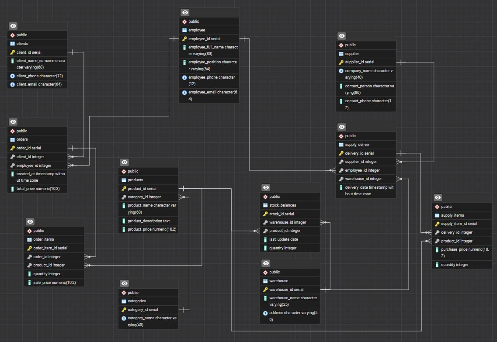
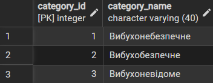
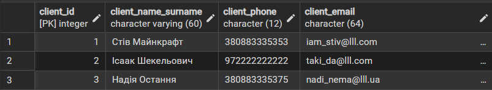
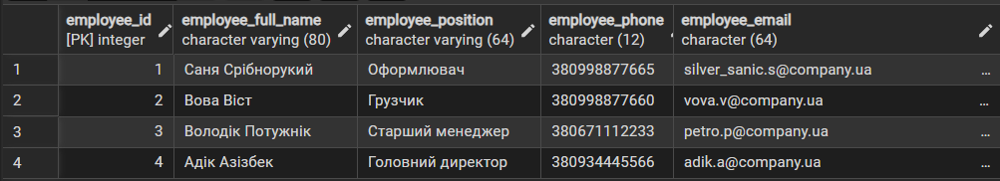
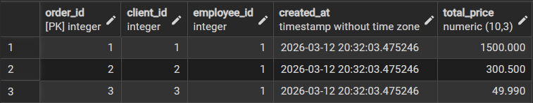
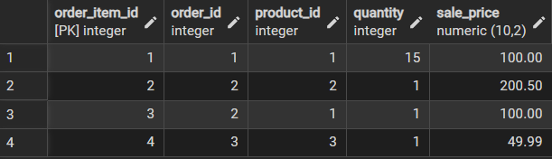
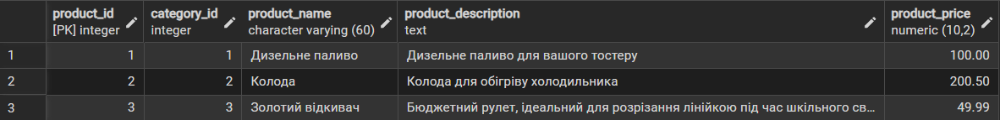
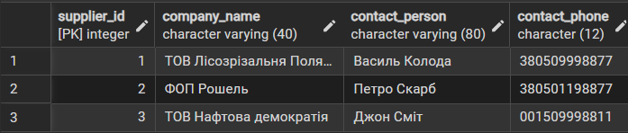
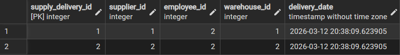
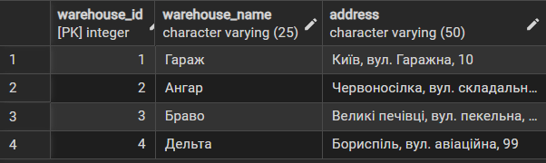

# Лабораторна робота №2

<strong>Група:</strong> ІО-42

<strong>Виконали:</strong> Коломієць В. М.,
Корсун Б. В.

<strong>Перевірив:</strong> Русінов В. В.

# Тема: 
Перетворення ER-діаграми на схему PostgreSQL
# Мета: 

•	Написати SQL DDL-інструкції для створення кожної таблиці з вашої ERD в PostgreSQL.

•	Вказати відповідні типи даних для кожного стовпця, вибрати первинний ключ для кожної таблиці та визначити будь-які необхідні зовнішні ключі, обмеження UNIQUE, NOT NULL, CHECK або DEFAULT.

•	Вставити зразки рядків (принаймні 3–5 рядків на таблицю) за допомогою INSERT INTO.

•	Протестувати все в pgAdmin (або іншому клієнті PostgreSQL), щоб переконатися, що таблиці та дані завантажуються правильно.

## SQL файл
Написані DDL-інструкції що реалізують ER-діаграму до першої лабораторної роботи
* [Посилання на SQL інструкції](https://github.com/korsunBohdan/DB_KPI_Kolomiets_Korsun_IO-42/blob/main/Lab2_Tables/Lab_work_tables.sql)

Автоматично згенерована ER-діаграма

   
  <i>Рисунок 2 – ER-діаграма бази даних магазину згенерована автоматично в pgadmin4</i>

## Заповнені таблиці данними

   
  <i>Рисунок 3 – Заповненна Category</i>

   
  <i>Рисунок 4 – Заповненна Client</i>

   
  <i>Рисунок 5 – Заповненна Employee</i>

   
  <i>Рисунок 6 – Заповненна Order</i>

   
  <i>Рисунок 7 – Заповненна Order items</i>

   
  <i>Рисунок 8 – Заповненна  Product</i>

   
  <i>Рисунок 9 – Заповненна  Stock balance</i>

   
  <i>Рисунок 10 – Заповненна Supplier </i>

   
  <i>Рисунок 11 – Заповненна Supply items</i>

   
  <i>Рисунок 12 – Заповненна Supply delivery</i>

   
  <i>Рисунок 13 – Заповненна Warehouse</i>

## Висновок
Було спроєктовано та реалізовано реляційну базу даних для управління складським обліком, постачаннями та продажами.
Розроблена база даних відповідає усім вимогам представленим у завдані до роботи
