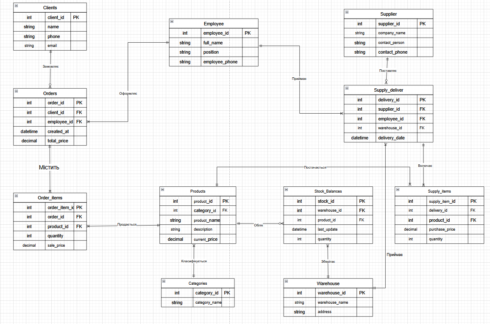

# Лабораторна робота №1

<strong>Група:</strong> ІО-42

<strong>Виконали:</strong> Коломієць В. М.,
Корсун Б. В.

<strong>Перевірив:</strong> Русінов В. В.

# Тема: 
Збір вимог та розробка схеми ER
# Мета: 
Створити документ з вимогами, який окреслює, які дані слід зберігати (сутності та атрибути) та їхні зв'язки. Виходячи з цих вимог, визначити ключові сутності та намалювати ER-діаграму – графічний план моделі даних.
Для виконання завдання ми обрали створити базу даних для магазину.

## Короткий виклад вимог
Інформаційна система, що призначена для зберігання даних онлайн-магазину. База даних повинна містити інформаію про каталог товарів, їх кількість на складі та ціну, інформацію про працівників, складські приміщення, постачальників, історію покупок клієнтів.

### Потреби зацікавлених сторін:

  •  Власник: Контроль залишків на різних складах, аналіз продажів у розрізі співробітників та моніторинг прибутковості.
  •  Менеджер із закупівель: Фіксація поставок від постачальників та оперативне оновлення складських запасів.
  •  Менеджер з продажу: Швидке оформлення замовлень із прив'язкою до клієнта та конкретного складу.

###	Основні правила, яких варто дотримуватись:

  •  Відповідальність: Кожне замовлення та поставка обов'язково закріплюються за співробітником, який провів операцію.
  •  Фіксація цін: Ціна продажу та закупівлі зберігається в момент транзакції для точності фінансової історії.
  •  Розподілений склад: Система веде облік кількості одного й того самого товару на різних фізичних складах.
  •  Ідентифікація: Замовлення мають бути пов'язані з клієнтом для аналізу історії покупок.
  •  Класифікація: Кожен товар обов'язково належить до певної категорії для зручної навігації.

## Діаграма ER
Матиме наступний вигляд:

   
  <i>Рисунок 1 – ER-діаграма бази даних магазину</i>

## Список сутностей та їх атрибути

### Таблиця 1 - Clients (Клієнти)
| Поле | Тип | Ключ | Опис |
|------|------|------|------|
| client_id | INT | PK | [cite_start]Ідентифікатор клієнта [cite: 97] |
| name | VARCHAR | | [cite_start]Ім'я клієнта [cite: 97] |
| phone | VARCHAR | | [cite_start]Телефон [cite: 97] |
| email | VARCHAR | | [cite_start]Пошта [cite: 97] |

### Таблиця 2 - Orders (Замовлення)
| Поле | Тип | Ключ | Опис |
|------|------|------|------|
| order_id | INT | PK | [cite_start]Ідентифікатор замовлення [cite: 99] |
| client_id | INT | FK | [cite_start]Посилання на клієнта [cite: 99] |
| employee_id | INT | FK | [cite_start]Посилання на працівника [cite: 99] |
| created_at | DATETIME | | [cite_start]Дата створення [cite: 99] |
| total_price | DECIMAL | | [cite_start]Вартість замовлення [cite: 99] |

### Таблиця 3 - Order_items (Список товарів у замовленні)
| Поле | Тип | Ключ | Опис |
|------|------|------|------|
| order_item_id | INT | PK | [cite_start]Ідентифікатор позиції в чеку [cite: 101] |
| order_id | INT | FK | [cite_start]Посилання на замовлення [cite: 101] |
| product_id | INT | FK | [cite_start]Посилання на товар [cite: 101] |
| quantity | INT | | [cite_start]Кількість одиниць [cite: 101] |
| sale_price | DECIMAL | | [cite_start]Ціна продажу [cite: 101] |

### Таблиця 4 - Products (Товари)
| Поле | Тип | Ключ | Опис |
|------|------|------|------|
| product_id | INT | PK | [cite_start]Ідентифікатор товару [cite: 103] |
| category_id | INT | FK | [cite_start]Посилання на категорію [cite: 103] |
| product_name | VARCHAR | | [cite_start]Назва товару [cite: 103] |
| description | VARCHAR | | [cite_start]Опис товару [cite: 103] |
| current_price | DECIMAL | | [cite_start]Поточна ціна товару [cite: 103] |

### Таблиця 5 - Categories (Категорії товарів)
| Поле | Тип | Ключ | Опис |
|------|------|------|------|
| category_id | INT | PK | [cite_start]Ідентифікатор категорії [cite: 105] |
| category_name | VARCHAR | | [cite_start]Назва категорії [cite: 105] |

### Таблиця 6 - Stock_balances (Кількість на складах)
| Поле | Тип | Ключ | Опис |
|------|------|------|------|
| stock_id | INT | PK | [cite_start]Ідентифікатор запису на складі [cite: 107] |
| warehouse_id | INT | FK | [cite_start]Посилання на склад [cite: 107] |
| product_id | INT | FK | [cite_start]Посилання на товар [cite: 107] |
| last_update | DATETIME | | [cite_start]Час останнього оновлення [cite: 107] |
| quantity | INT | | [cite_start]Кількість товару [cite: 107] |

### Таблиця 7 - Warehouse (Склади)
| Поле | Тип | Ключ | Опис |
|------|------|------|------|
| warehouse_id | INT | PK | [cite_start]Ідентифікатор складу [cite: 109] |
| warehouse_name | VARCHAR | | [cite_start]Назва складу [cite: 109] |
| address | VARCHAR | | [cite_start]Адреса фізичного розташування [cite: 109] |

### Таблиця 8 - Supplier (Постачальники)
| Поле | Тип | Ключ | Опис |
|------|------|------|------|
| supplier_id | INT | PK | [cite_start]Ідентифікатор постачальника [cite: 111] |
| company_name | VARCHAR | | [cite_start]Назва компанії [cite: 111] |
| contact_person | VARCHAR | | [cite_start]ПІБ контактної особи [cite: 111] |
| contact_phone | VARCHAR | | [cite_start]Телефон постачальника [cite: 111] |

### Таблиця 9 - Supply_deliver (Доставка/Поставки)
| Поле | Тип | Ключ | Опис |
|------|------|------|------|
| delivery_id | INT | PK | [cite_start]Ідентифікатор доставки [cite: 113] |
| supplier_id | INT | FK | [cite_start]Посилання на постачальника [cite: 113] |
| employee_id | INT | FK | [cite_start]Посилання на працівника (приймальника) [cite: 113] |
| warehouse_id | INT | FK | [cite_start]Посилання на склад призначення [cite: 113] |
| delivery_date | DATETIME | | [cite_start]Дата доставки [cite: 113] |

### Таблиця 10 - Supply_items (Накладна на поставку)
| Поле | Тип | Ключ | Опис |
|------|------|------|------|
| supply_item_id| INT | PK | [cite_start]Ідентифікатор рядка накладної [cite: 115] |
| delivery_id | INT | FK | [cite_start]Посилання на доставку [cite: 115] |
| product_id | INT | FK | [cite_start]Посилання на товар [cite: 115] |
| purchase_price| DECIMAL | | [cite_start]Ціна закупки товару [cite: 115] |
| quantity | INT | | [cite_start]Кількість прийнятого товару [cite: 115] |

### Таблиця 11 - Employee (Працівники)
| Поле | Тип | Ключ | Опис |
|------|------|------|------|
| employee_id | INT | PK | [cite_start]Ідентифікатор працівника [cite: 117] |
| full_name | VARCHAR | | [cite_start]ПІБ працівника [cite: 117] |
| position | VARCHAR | | [cite_start]Посада [cite: 117] |
| employee_phone| VARCHAR | | [cite_start]Робочий телефон [cite: 117] |

**PK** – первинний ключ, **FK** – зовнішній ключ.

## Зв'язки та припущення з обмеженням

  •	Клієнт — Замовлення: 1:N (кожен клієнт може мати багато замовлень).
  •	Персонал — Операції: 1:N (співробітник відповідає за конкретне замовлення або поставку).
  •	Товар — Категорія: 1:N (кожен товар належить до однієї категорії).
  •	Замовлення — Товари: M:N через Order_items (багато товарів у чеку).
  •	Склад — Товари: M:N через Stock_Balances (облік кількості товару на різних складах).

## Припущення та обмеження:

  •	Ціни: Поточна ціна продукту в Products може змінюватися, тому ціна продажу/закупівлі дублюється в Order_items та Supply_items для історії.
  •	Склади: Один і той самий товар може зберігатися одночасно на різних локаціях.
  •	Цілісність: Замовлення не може бути анонімним (обов'язкова прив'язка до client_id).
  •	Одиниці виміру: Припускається, що всі товари обліковуються у штуках.
  •	Постачальник — Поставка: 1:N (поставка закріплена за одним контрагентом).

## Висновок
Було розроблено ER-діаграму, що забезпечує автоматизацію обліку товарів, продажів та складських запасів. 
Структура сутностей дозволяє відстежувати повний цикл руху продукції: від надходження від постачальників до реалізації клієнтам із фіксацією історичних цін. 
Модель мінімізує дублювання даних, підтримує роботу з кількома складами та є готовим фундаментом для впровадження масштабованої системи управління магазином.
