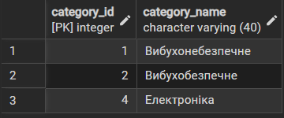
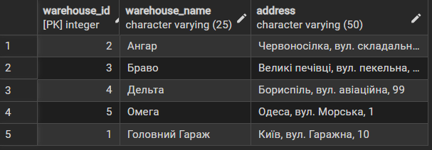

# Лабораторна робота №3

<div align="right">
<strong>Група:</strong> ІО-42

<strong>Виконали:</strong> Коломієць В. М.,
Корсун Б. В.

<strong>Перевірив:</strong> Русінов В. В.
</div>
# Тема: 
Маніпулювання даними SQL (OLTP)

# Мета: 

- Написати запити `SELECT` для отримання даних (включаючи фільтрацію за допомогою `WHERE` та вибір певних стовпців).
- Практикувати використання операторів `INSERT` для додавання нових рядків до таблиць.
- Практикувати використання оператора `UPDATE` для зміни існуючих рядків (використовуючи `SET` та `WHERE`).
- Практикувати використання операторів `DELETE` для безпечного видалення рядків (за допомогою `WHERE`).
- Вивчити основні операції маніпулювання даними (DML) у PostgreSQL та спостерігати за їхнім впливом.


## SQL файл
Написані OLTPL-інструкції що реалізують маніпуляцію данними та їх заміну
* [Посилання на OLTP_SQL інструкції](Lab_3.sql)

## SQL скрипти

```sql
-- Спочатку видаляємо згадки про товар із деталей замовлень
DELETE FROM order_items
WHERE product_id IN (SELECT product_id FROM products WHERE category_id = 3);
```

```sql
-- Видаляємо згадки про товар із деталей поставок
DELETE FROM supply_items
WHERE product_id IN (SELECT product_id FROM products WHERE category_id = 3);
```

```sql
--  Видаляємо цей товар із залишків на складах
DELETE FROM stock_balances
WHERE product_id IN (SELECT product_id FROM products WHERE category_id = 3);
```

```sql
-- Тепер база дозволить безпечно видалити сам товар
DELETE FROM products
WHERE category_id = 3;
```

```sql
-- Видаляємо непотрібну категорію
DELETE FROM categories
WHERE category_name = 'Вибухоневідоме';
```

```sql
-- Додавання нової категорії товарів
INSERT INTO categories (category_name)
VALUES ('Електроніка');
```

```sql
-- Додавання нового складу
INSERT INTO warehouse (warehouse_name, address)
VALUES ('Омега', 'Одеса, вул. Морська, 1');
```

```sql
-- Додавання нового товару до нової категорії
INSERT INTO products (category_id, product_name, product_description, product_price)
VALUES (4, 'Павербанк', 'Для живлення роутера під час відключень', 1500.00);
```

```sql
-- Оновлення ціни товару у зв'язку з високими цінами на бензин
UPDATE products
SET product_price = 120.00
WHERE product_id = 1;
```

```sql
-- Зміна контактної пошти клієнта
UPDATE clients
SET client_email = 'new_nadi@lll.ua'
WHERE client_id = 3;
```

```sql
-- Оновлення назви складу
UPDATE warehouse
SET warehouse_name = 'Головний Гараж'
WHERE warehouse_name = 'Гараж';
```

```sql
-- Видалення дрібних замовлень та їхніх деталей
DELETE FROM order_items
WHERE order_id IN (SELECT order_id FROM orders WHERE total_price < 50.00);
DELETE FROM orders
WHERE total_price < 50.00;
```

```sql
-- Отримання списку всіх категорій
SELECT * FROM categories;
```

```sql
-- Отримання всіх товарів конкретної категорії (наприклад, Вибухонебезпечне)
SELECT * FROM products
WHERE category_id = 4;
```

```sql
-- Перегляд усіх складів
SELECT * FROM warehouse;
```

```sql
-- Перегляд усіх клієнтів
SELECT * FROM clients;
```


## Висновок
Було написано SQL скрипт у якому були використані усі види маніпуляції данними відповідає вимогам представленим у завдані до роботи.
