# Лабораторна робота №4

<div align="right">
<strong>Група:</strong> ІО-42

<strong>Виконали:</strong> Коломієць В. М.,
Корсун Б. В.

<strong>Перевірив:</strong> Русінов В. В.
</div>
# Тема: 
Маніпулювання даними SQL (OLTP) 

# Мета: 

- Використовувати агрегатні функції, такі як `COUNT`, `SUM`, `AVG`, `MIN` та `MAX`, для обчислення зведеної статистики з ваших даних.
- Написати запити `GROUP BY` для групування рядків за одним або кількома стовпцями та обчислення агрегатів для кожної групи.
- Використовувати `HAVING` для фільтрації результатів згрупованих запитів на основі агрегованих умов.
- Виконувати операції `JOIN` (принаймні `INNER JOIN` та `LEFT JOIN`), щоб об'єднати дані з кількох таблиць.
- Створювати об'єднані запити на агрегацію для кількох таблиць, які об'єднують таблиці та створюють згрупований, агрегований вивід.
- Інтерпретувати результати ваших запитів та пояснити, що робить кожен з них.

## SQL файл
Написані OLAP-інструкціЙ 
* [Посилання на OLAP_SQL інструкції](Lab_4_OLAP.sql)
* [Доповнення таблиці данними](Lab_4_insert_date.sql)

## SQL скрипти

```sql
-- 1. Підрахунок загальної кількості замовлень
-- Аналіз загальної кількості клієнтів
SELECT COUNT(*) AS total_orders
FROM orders;
```
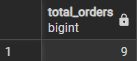
```sql
-- 2. Обчислення середнього чека замовлення
-- Дозволяє оцінити купівельну спроможність клієнтів
SELECT ROUND(AVG(total_price), 2) AS average_order_value
FROM orders;
```

```sql
-- 3. Сумарний дохід за кожною категорією товарів
-- Допомагає визначити найбільш прибуткові категорії
SELECT c.category_name, 
       SUM(oi.quantity * oi.sale_price) AS total_revenue
FROM categories c
JOIN products p ON c.category_id = p.category_id
JOIN order_items oi ON p.product_id = oi.product_id
GROUP BY c.category_name;
```
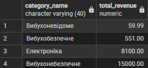
```sql
-- 4. Кількість товарів на кожному складі
-- Аналіз завантаженості складських приміщень
SELECT w.warehouse_name, 
       SUM(sb.quantity) AS total_items_in_stock
FROM warehouse w
JOIN stock_balances sb ON w.warehouse_id = sb.warehouse_id
GROUP BY w.warehouse_name;
```
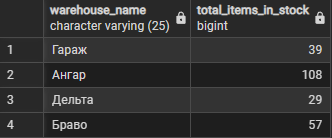
```sql
-- 5. Товари, запас яких на складі менше 10 одиниць
-- Виявлення позицій, які терміново потрібно замовити у постачальників
SELECT p.product_name, 
       sb.quantity, 
       w.warehouse_name
FROM stock_balances sb
JOIN products p ON sb.product_id = p.product_id
JOIN warehouse w ON sb.warehouse_id = w.warehouse_id
WHERE sb.quantity < 10;
```
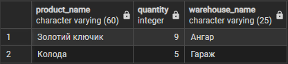
```sql
-- 6. Рейтинг менеджерів за сумою оформлених замовлень
-- Оцінка ефективності роботи персоналу (KPI)
SELECT e.employee_full_name, 
       COUNT(o.order_id) AS orders_processed,
       ROUND(SUM(o.total_price), 2) AS total_sales_amount
FROM employee e
JOIN orders o ON e.employee_id = o.employee_id
GROUP BY e.employee_full_name
ORDER BY total_sales_amount DESC;
```
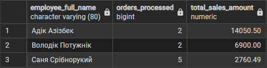
```sql
-- 7. Клієнти, які зробили замовлень на суму понад 1000 грн (HAVING)
-- Виокремлення сегменту VIP-клієнтів
SELECT c.client_name_surname, 
       ROUND(SUM(o.total_price), 2) AS total_spent
FROM clients c
JOIN orders o ON c.client_id = o.client_id
GROUP BY c.client_name_surname
HAVING SUM(o.total_price) > 1000;
```
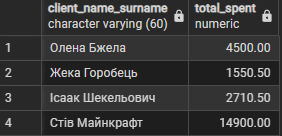
```sql
-- 8. Товари, які ніколи не продавалися
-- Аналіз неходових товарів ("мертві" товари)
SELECT p.product_name
FROM products p
LEFT JOIN order_items oi ON p.product_id = oi.product_id
WHERE oi.order_item_id IS NULL;

```
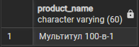
```sql
-- 9. Товари, ціна яких вища за середню в їхній категорії
-- Використання підзапиту для порівняння цін
SELECT p.product_name, 
       ROUND(p.product_price, 2) AS price, 
       c.category_name
FROM products p
JOIN categories c ON p.category_id = c.category_id
WHERE p.product_price > (
    SELECT ROUND(AVG(product_price), 2) 
    FROM products 
    WHERE category_id = p.category_id
);
```

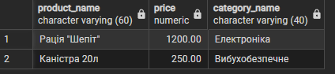
```sql
-- 10. Аналіз прибутковості: Різниця між ціною закупівлі та продажу
-- Показує маржинальність по конкретних позиціях
SELECT p.product_name,
       ROUND(AVG(oi.sale_price), 2) AS avg_sale,
       ROUND(AVG(si.purchase_price), 2) AS avg_buy,
       ROUND((AVG(oi.sale_price) - AVG(si.purchase_price)), 2) AS margin_per_unit
FROM products p
JOIN order_items oi ON p.product_id = oi.product_id
JOIN supply_items si ON p.product_id = si.product_id
GROUP BY p.product_name;
```
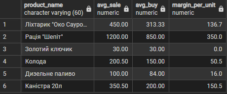

```sql
-- 11.Найдорожчі та найдешевші товари в каталогах
-- Показує ціновий діапазон в категорії
SELECT 
    ROUND(MIN(product_price), 2) AS min_catalog_price,
    ROUND(MAX(product_price), 2) AS max_catalog_price
FROM products;
```
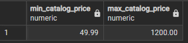

```sql
-- 12.Діапазон цін за кожною категорією
-- Це показує найдешевший,та найдорожчий товар у категорії 
SELECT 
    c.category_name,
    ROUND(MIN(p.product_price), 2) AS min_price,
    ROUND(MAX(p.product_price), 2) AS max_price
FROM categories c
JOIN products p ON c.category_id = p.category_id
GROUP BY c.category_name;
```
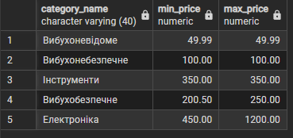

```sql
-- 13.Рамки роботи магазину
-- Дати першого та останього замовлення
SELECT 
    MIN(created_at) AS first_order_date,
    MAX(created_at) AS last_order_date
FROM orders;
```
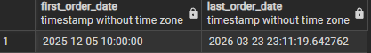

```sql
-- 14.Максимальна кількість одиниць товару в одному чеку
-- Показує які товари купують оптом
SELECT 
    p.product_name,
    MAX(oi.quantity) AS max_sold_at_once
FROM order_items oi
JOIN products p ON oi.product_id = p.product_id
GROUP BY p.product_name
ORDER BY max_sold_at_once DESC;
```
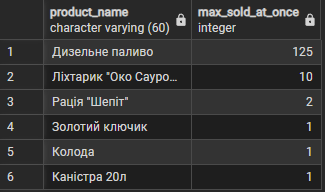

```sql
-- 15.Найбільша та найменша ціна закупівлі від постачальників
-- Зміна у ціні закупівлі
SELECT 
    p.product_name,
    ROUND(MIN(si.purchase_price), 2) AS best_buy_price,
    ROUND(MAX(si.purchase_price), 2) AS worst_buy_price
FROM supply_items si
JOIN products p ON si.product_id = p.product_id
GROUP BY p.product_name;
```
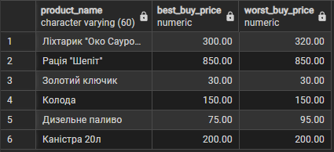

## Висновок

Було створено OLTP запроси які можуть допомогти при аналізі роботит магазину.
При виконанні цієї роботи було використано `COUNT`, `SUM`, `AVG`, `MIN` та `MAX` як це було рекомендовано у методичних данних.