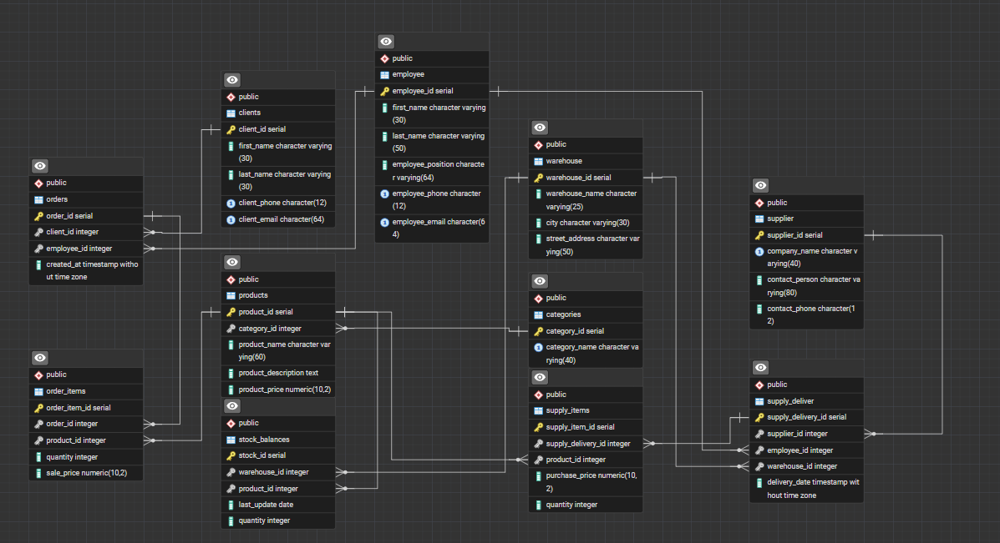

# Лабораторна робота №5

<div align="right">
<strong>Група:</strong> ІО-42

<strong>Виконали:</strong> Коломієць В. М.,
Корсун Б. В.

<strong>Перевірив:</strong> Русінов В. В.
</div>
# Тема: 
Нормалізація бази даних

# Мета: 

- Пошук надлишковості та аномалій: виявлення потенційної надлишковості даних (наприклад, повторювані значення) або аномалій оновлення (проблеми вставки/оновлення/видалення) у поточній схемі.
- Перелік функціональних залежностей: визначте та перелічіть функціональні залежності (ФЗ) для кожної проблемної таблиці.
- Перевірка нормальних форм: оцініть поточну нормальну форму кожної таблиці (`1NF`, `2NF`, `3NF`) на основі її функціональних залежностей (ФЗ) та структури ключа.
- Застосування нормалізації: перетворення таблиць у вищі нормальні форми (до 3НФ) для усунення часткових та транзитивних залежностей.

## 1. Початковий дизайн таблиць

Для демонстрації процесу нормалізації розглянемо початковий стан бази даних обліку складських запасів та замовлень. Припустимо, що на етапі проєктування (або до впровадження сурогатних ключів) дані про клієнтів, склади та замовлення зберігалися у ненормалізованих або частково нормалізованих структурах, де допускалися списки та комплексні рядки.

**Проблемні атрибути початкової схеми:**
* У таблиці `clients` поле `client_name_surname` містить ім'я та прізвище разом.
* У таблиці `warehouse` поле `address` містить місто, вулицю та номер будинку в одному рядку.
* У таблиці `orders` присутнє поле `total_price`, яке обчислюється на основі інших таблиць.
* У таблицях зв'язків для `order_items` відсутнє обмеження на логічний складений ключ, що дозволяє дублювати однакові товари в одному замовленні різними рядками.

**Аналіз проблеми**
Поточна схема порушує `1NF` через наявність неатомарних полів (комбіновані імена та адреси `address`,`client_name_surname`). Також порушується `3NF` через наявність транзитивних залежностей (обчислювані поля, що залежать від даних у суміжних таблицях).

---

## 2. Функціональні залежності (ФЗ)

Аналіз початкової (ненормалізованої) структури виявляє наступний мінімальний набір функціональних залежностей:

1. **ФЗ 1 (Повна залежність):** `{order_id, product_id} -> {quantity,     sale_price}`
Кількість та ціна продажу залежать виключно від конкретного замовлення та конкретного товару в ньому.
2. **ФЗ 2 (Часткова залежність / Порушення атомарності):** `client_id -> {client_name_surname, client_phone, client_email}`
Контактні дані залежать від ідентифікатора клієнта, але `client_name_surname` потребує декомпозиції.
3. **ФЗ 3 (Часткова залежність / Порушення атомарності):** `warehouse_id -> {warehouse_name, address}`
Дані складу залежать від його ID, але `address` є композитним атрибутом.
4. **ФЗ 4 (Транзитивна залежність):** `order_id -> {total_price}`
Загальна вартість замовлення `total_price` логічно залежить від суми добутків `quantity * sale_price` з таблиці `order_items`, а не безпосередньо від `order_id`. Це створює аномалію оновлення.

---

## 3. Нормалізація

### 1. Перехід до '1NF'. Усунення неатомарних атрибутів
* **Проблема:** Поля `client_name_surname` (у клієнтів), `employee_full_name` (у працівників) та `address` (у складів) порушують вимогу атомарності атрибутів.
* **Рішення:**Розділяємо ці поля на окремі атомарні стовпці: `first_name`, `last_name`, `city`, `street_address`.
* **Результат:**Таблиці відповідають `1NF`. Кожне поле містить лише одне логічне значення.

### 2. Перехід до '2NF'. Фіксація логічних складених ключів
* **Проблема:** Оскільки використовуються сурогатні ключі `SERIAL`, технічно залежності від частини ключа немає. Однак логічно в проміжних таблицях `order_items`, `supply_items` та `stock_balances` відсутній захист від аномалій вставки (дублювання `product_id` для одного `order_id`).
* **Рішення:** Створюємо обмеження `UNIQUE` для логічних композитних ключів.
* **Результат:** Таблиці відповідають `2NF`, усунено можливість часткового дублювання записів.

### 3. Перехід до '3NF'. Усунення транзитивних залежностей
* **Проблема:** У таблиці `orders` атрибут `total_price` залежить від розрахунків у таблиці `order_items`. Якщо змінити ціну товару або кількість, поле `total_price` стане недійсним.
* **Рішення:** Видаляємо поле `total_price` з фізичної таблиці. Ця інформація має отримуватися динамічно через агрегатні функції SQL `SUM`.
* **Результат (Фінальні таблиці в `3NF`): Схема повністю нормалізована, всі неключові атрибути залежать виключно від первинних ключів своїх таблиць.

---

## 4.Трансформація структури (ALTER TABLE)

Нижче наведено команди для переведення початкових таблиць до відповідних нормальних форм.

### Крок 1: Перехід до `1NF`:
```sql
-- Розділення імені клієнта
alter table clients drop column client_name_surname;
alter table clients add column first_name VARCHAR(30) NOT NULL;
alter table clients add column last_name VARCHAR(30) NOT NULL;

-- Розділення імені співробітника
alter table employee drop column employee_full_name;
alter table employee add column first_name VARCHAR(30) NOT NULL;
alter table employee add column last_name VARCHAR(50) NOT NULL;

-- Розділення адреси складу
alter table warehouse drop column address;
alter table warehouse add column city VARCHAR(30) NOT NULL;
alter table warehouse add column street_address VARCHAR(50) NOT NULL;
```

### Крок 2: Перехід до `2NF`:
```sql
-- Забезпечення цілісності логічних складених ключів
alter table stock_balances add constraint unique_warehouse_product UNIQUE (warehouse_id, product_id);
alter table order_items add constraint unique_order_product UNIQUE (order_id, product_id);
alter table supply_items add constraint unique_supply_product UNIQUE (supply_delivery_id, product_id);
```

### Крок 3: Перехід до `3NF`:
```sql
-- Видалення транзитивної залежності
alter table orders drop column total_price;
```

---

## 5. Перероблений дизайн таблиць (SQL)

Нижче наведено фінальні команди створення `CREATE TABLE` для ключових таблиць у `3NF` з урахуванням усіх змін.

```sql 
create table clients (
    client_id SERIAL PRIMARY KEY,
    first_name VARCHAR(30) NOT NULL,
    last_name VARCHAR(30) NOT NULL,
    client_phone CHAR(12) NOT NULL UNIQUE,
    client_email CHAR(64) NOT NULL UNIQUE
);

create table warehouse (
    warehouse_id SERIAL PRIMARY KEY,
    warehouse_name VARCHAR(25) NOT NULL,
    city VARCHAR(30) NOT NULL,
    street_address VARCHAR(50) NOT NULL
);

create table orders (
    order_id SERIAL PRIMARY KEY,
    client_id INT NOT NULL REFERENCES clients(client_id), 
    employee_id INT NOT NULL REFERENCES employee(employee_id),
    created_at TIMESTAMP NOT NULL DEFAULT current_timestamp
    -- Поле total_price видалено для відповідності 3NF
);

create table order_items (
    order_item_id SERIAL PRIMARY KEY,
    order_id INT NOT NULL REFERENCES orders(order_id),
    product_id INT NOT NULL REFERENCES products(product_id),
    quantity INT NOT NULL DEFAULT(0) CHECK(quantity >= 0),
    sale_price DECIMAL(10, 2) NOT NULL CHECK(sale_price >= 0),
    constraint unique_order_product UNIQUE (order_id, product_id) 
    -- Фіксація 2NF
);
```
### Нормалізований SQL файл.
* [Посилання на нормалізовані SQL інструкції](sql/Lab_work_tables_normalaizet.sql)

### ER-діаграма оновленої бази даних



---

## Висновок
У ході виконання лабораторної роботи було проаналізовано початкову схему бази даних складського обліку магазину. Було виявлено порушення `1NF` (неатомарні атрибути) та `3NF` (транзитивні залежності у вигляді обчислюваних полів). Шляхом декомпозиції полів, додавання унікальних обмежень для логічних зв'язків багато-до-багатьох та видалення надлишкових обчислюваних даних, схему було успішно приведено до Третьої нормальної форми `3NF`.