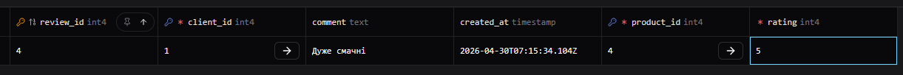
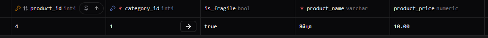

# Лабораторна робота №6

<div align="right">
<strong>Група:</strong> ІО-42

<strong>Виконали:</strong> Коломієць В. М.,
Корсун Б. В.

<strong>Перевірив:</strong> Русінов В. В.
</div>
# Тема: 
Міграції схем за допомогою Prisma ORM

# Мета: 

- Використати Prisma ORM для керування схемами та дослідити, як Prisma може аналізувати та змінювати схему вашої бази даних.
- Застосування міграцій - генерування та застосування змін схеми (таблиць, стовпців, зв'язків) за допомогою `prisma migrate`.
- Моделювання за допомогою файлів схеми Prisma - визначення таблиць та зв'язків у `schema.prisma` та перегляд їхнього відображення в PostgreSQL.
- Виконати базові запити Prisma - вставити та запитати дані за допомогою клієнта Prisma (через *Prisma Studio* або простий скрипт) для перевірки змін.

## 1. Міграція add_product_reviews

Було створено нову таблицю `product_reviews` для зберігання відгуків користувачів про товари. 

**schema.prisma:**
```prisma
// Додано нову модель Review
model product_reviews {
  review_id   Int      @id @default(autoincrement())
  product_id  Int
  client_id   Int
  rating      Int      // Оцінка від 1 до 5
  comment     String?
  created_at  DateTime @default(now()) @db.Timestamp(6)
  clients     clients  @relation(fields: [client_id], references: [client_id], onDelete: NoAction, onUpdate: NoAction)
  products    products @relation(fields: [product_id], references: [product_id], onDelete: NoAction, onUpdate: NoAction)
}
// До моделі products додано зв'язок
model products {
  product_id          Int              @id @default(autoincrement())
  category_id         Int
  product_name        String           @db.VarChar(60)
  product_description String?
  product_price       Decimal          @default(0.00) @db.Decimal(10, 2)
  order_items         order_items[]
  categories          categories       @relation(fields: [category_id], references: [category_id], onDelete: NoAction, onUpdate: NoAction)
  stock_balances      stock_balances[]
  supply_items        supply_items[]
  product_reviews product_reviews[]  // Додано поле
}
// До моделі clients додано зв'язок
model clients {
  client_id    Int      @id @default(autoincrement())
  first_name   String   @db.VarChar(30)
  last_name    String   @db.VarChar(30)
  client_phone String   @unique @db.Char(12)
  client_email String   @unique @db.Char(64)
  orders       orders[]
  product_reviews product_reviews[]  // Додано поле
}
```
---
migration.sql:

```sql
CREATE TABLE "product_reviews" (
    "review_id" SERIAL NOT NULL,
    "product_id" INTEGER NOT NULL,
    "client_id" INTEGER NOT NULL,
    "rating" INTEGER NOT NULL,
    "comment" TEXT,
    "created_at" TIMESTAMP(6) NOT NULL DEFAULT CURRENT_TIMESTAMP,

    CONSTRAINT "product_reviews_pkey" PRIMARY KEY ("review_id")
);
-- Додавання зовнішніх ключів
-- Для таблиці client
ALTER TABLE "product_reviews" ADD CONSTRAINT "product_reviews_client_id_fkey" FOREIGN KEY ("client_id") REFERENCES "clients"("client_id") ON DELETE NO ACTION ON UPDATE NO ACTION;
-- Для таблиці product
ALTER TABLE "product_reviews" ADD CONSTRAINT "product_reviews_product_id_fkey" FOREIGN KEY ("product_id") REFERENCES "products"("product_id") ON DELETE NO ACTION ON UPDATE NO ACTION;
```

## 2. Міграція add_is_fragile_to_products

До існуючої таблиці товарів `products` було додано нове логічне поле `is_fragile`, яке за замовчуванням має значення `true`. Це дозволяє відстежувати крихкість товару.
```prisma
model products {
  product_id          Int              @id @default(autoincrement())
  category_id         Int
  product_name        String           @db.VarChar(60)
  product_description String?
  product_price       Decimal          @default(0.00) @db.Decimal(10, 2)
  is_fragile          Boolean           @default(false) // Додавання нового поля
  order_items         order_items[]
  categories          categories       @relation(fields: [category_id], references: [category_id], onDelete: NoAction, onUpdate: NoAction)
  stock_balances      stock_balances[]
  supply_items        supply_items[]
  product_reviews product_reviews[]  // Додано поле
}
```

**migration.sql:**
```sql
ALTER TABLE "products" ADD COLUMN     "is_fragile" BOOLEAN NOT NULL DEFAULT false;
```

---

## 3. Міграція drop_product_description

З моделі products було видалено стовпець `model` (модель товару), оскільки він більше не потрібен для бізнес-логіки магазину.

**schema.prisma:**
```prisma
model products {
  product_id          Int              @id @default(autoincrement())
  category_id         Int
  product_name        String           @db.VarChar(60)
  // Рядок product_description видалено
  product_price       Decimal          @default(0.00) @db.Decimal(10, 2)
  is_fragile          Boolean           @default(false) // Додавання поля
  order_items         order_items[]
  categories          categories       @relation(fields: [category_id], references: [category_id], onDelete: NoAction, onUpdate: NoAction)
  stock_balances      stock_balances[]
  supply_items        supply_items[]
  product_reviews product_reviews[]
}
```

**migration.sql:**

```sql
ALTER TABLE "products" DROP COLUMN "product_description";
```
---

## 4. Результати перевірки (Prisma Studio)

Для перевірки коректності застосованих міграцій було використано інтерфейс **Prisma Studio**. 

**1. Перевірка створення таблиці Review:**

У нову таблицю успішно додано запис відгуку, який пов'язаний із товаром (`product_id: 4`).



**2. Перевірка зміни таблиці products:**

Як видно на знімку екрана нижче, у таблиці товарів успішно з'явилося нове поле `is_fragile`. Також можна переконатися, що поле `product_description` було успішно видалено зі структури бази даних.



## Висновок
У ході виконання лабораторної роботи було виконано міграцію за допомогою Prisma ORM, підчас міграції були додано та змінено вже існуючі таблиці.